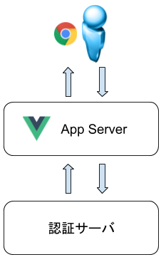
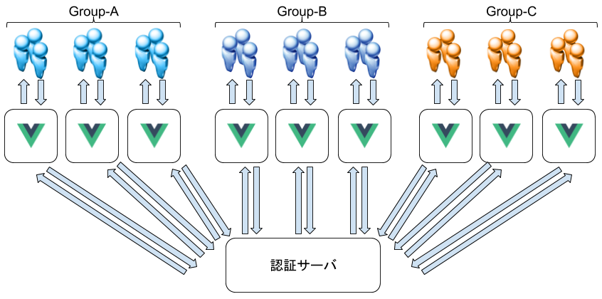
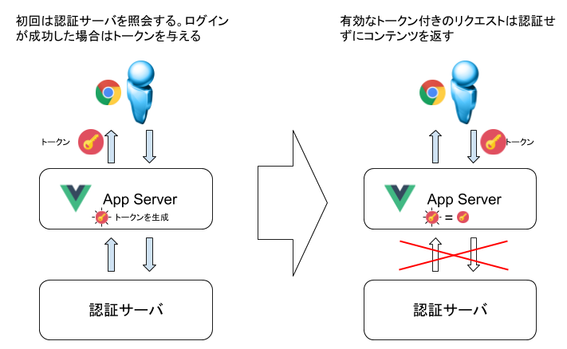
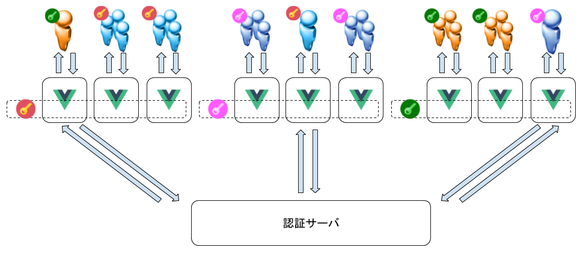
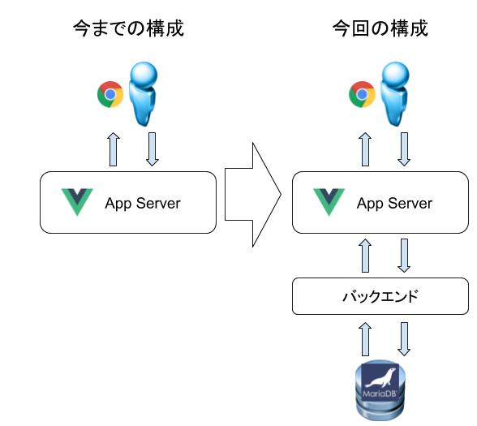

# 06-vuejs-spa-example3

前回で vue.js を使った簡便な認証を実装した。今回は認証機構をスケーラブルに拡張する。

## 取り組もうとしている課題 - トークンを使用した認証サーバの負荷緩和

実際にはWebサービスを提供するサーバと認証機能を提供するサーバは異なることが一般的。以下のような構成となる。認証サーバにはMySQLなどのデータベースが用いられることが多い。



ただし、この構成ではユーザ数が大幅に増えた場合に認証サーバに負荷が集中し、応答の遅延によるUXの低下、正しいユーザ名・パスワードを入力しているにも関わらず認証以外の問題によるログイン障害などを引き起こす可能性がある。



これを解決する方策として一般的に使用されているのが「セッショントークン」によるログインの簡素化。

セッショントークンとは、一度認証を通過したユーザに一定期間有効なトークンを与え、トークン付きのアクセスについては認証済みとみなし、アプリケーションを使用させる方策である。これにより認証サーバへのアクセス集中を緩和させることができる。



一般的にはJSON Web Token(JWT)が使用されている。

- https://jwt.io/
- https://qiita.com/kaiinui/items/21ec7cc8a1130a1a103a

JWTは鍵を使用してトークン内容を解読し、読み出すため、複数サーバにわたってセッションを維持したい場合は、そのサーバ間で同一の鍵を持つことでトークンを共有することになる。鍵を変えれば、そのサーバにアクセスした場合にはトークンを解読できないためエラーとなり、その後の処理でログイン画面にリルートすることができるようになる。

またトークンには有効期限を設けることができる。トークンが発行されるたびに有効期限にばらつきをもたせることによって、認証サーバへの同時アクセスを分散させることができるようになり、認証サーバの負荷を軽減させることができる。

またこれには副次的な効果として、通常特定のサーバ(Vue.jsインスタンス)にリクエストを送っているクライアントが何かしらの理由で異なるVue.jsインスタンスにリクエストを送った場合、鍵が異なっていればリクエストのトークンを解読できずエラーとなり、認証サーバでの認証をやり直すことになる。つまり「ユーザが通常と異なる行動を取ったこと」を検知し、適切に再認証を行わせることが可能になる。



## 実装の概要

完全な成果物については https://github.com/mkiuchi/vue-03-jwt を参照のこと

では実装する。今回から今までの vue.js インスタンスに加えてバックエンド、DBが登場する。vue.jsは直接MariaDBなどにアクセスすることができず、HTTPリクエストしかできないため、バックエンドプログラムを作成してHTTPリクエストを受け付けるAPIを作成する。



---

前回の続きから作成する。以下は前回時の構成。

- /: トップページ
    - /Login に無条件でリダイレクトする
- /Login: 認証を行うページ
    - 実際の認証を行う
- /PageA: 実際のコンテンツページA
    - 認証されているかどうかをチェックする
        - 認証されていればページを表示
        - 認証されていない場合は `/Login` にジャンプ
- /PageB: 実際のコンテンツページB
    - 認証されているかどうかをチェックする
        - 認証されていればページを表示
        - 認証されていない場合は `/Login` にジャンプ

これを以下のように改修する。

```
(root)
├── README.md 今読んでいるこのドキュメント
├── (新規) backend
│  │        ここにバックエンド側のロジックを作成していく。
│  │        今回は認証用のAPIを1つだけ定義する
│  ├── (新規) requirements.txt
│  │            動作に必要なPythonパッケージの一覧
│  └── (新規) app.py
│                APIプログラム
└── (新規) frontend
    │        ここが前回のroot。ディレクトリを作成して前回のソースコードをまるごと移動している
    ├── build
    ├── config
    ├── index.html
    ├── node_modules
    │   └── (省略)
    ├── package-lock.json
    ├── package.json
    ├── src
    │   ├── App.vue
    │   ├── assets
    │   │   └── logo.png
    │   ├── components
    │   │   ├── HelloWorld.vue
    │   │   │        (未使用)
    │   │   ├── (改修)Login.vue
    │   │   │     /: トップページ
    │   │   │        /Loginに無条件でリダイレクト
    │   │   │     /Login: 認証を行うページ
    │   │   │        実際に認証を行う。今回はバックエンド側のAPI呼び出しを行うよう改修する
    │   │   ├── NotFound.vue
    │   │   │     /*: NotFoundページ
    │   │   │        vue-routerに指定されていないページを指定した場合、このページの内容を表示する
    │   │   ├── (改修)PageA.vue
    │   │   │     /PageA: 実際のコンテンツページA
    │   │   │        今回以下のように改修を行う
    │   │   │          - JWTをチェック
    │   │   │              - 有効であればページを表示
    │   │   │              - 有効期限切れ、もしくは何かしらエラーがあった場合は /Login にジャンプ
    │   │   └── (改修)PageB.vue
    │   │          /PageB: 実際のコンテンツページB
    │   │             今回以下のように改修を行う
    │   │               - JWTをチェック
    │   │                   - 有効であればページを表示
    │   │                   - 有効期限切れ、もしくは何かしらエラーがあった場合は /Login にジャンプ
    │   ├── main.js
    │   └── router
    │       └── index.js
    ├── static
    └── test
```

## 実装(1-1) MariaDBベースの認証に改修

まずMariaDBをセットアップし、デモ用の認証情報を作成する。

```shell
dnf -y install mariadb-server
systemctl enable mariadb
systemctl start mariadb
mysqladmin -u root password 'root'
mysqladmin -u root -h laptop.mkhome password 'root'
mysql -u root -p
Enter password: ('root'を入れる)
MariaDB [(none)]>
```

データベース、テーブルを作成

```shell
MariaDB [(none)]> create database vuejs;
Query OK, 1 row affected (0.00 sec)
MariaDB [(none)]> create table vuejs.auth (id int, name varchar(63), password varchar(255));
Query OK, 0 rows affected (0.04 sec)
```

エントリを挿入する

```shell
MariaDB [(none)]> insert into vuejs.auth (id, name, password) values (1,'myid', 'mypasswd1234');
Query OK, 1 row affected (0.00 sec)
MariaDB [(none)]> select * from vuejs.auth;
+------+------+--------------+
| id   | name | password     |
+------+------+--------------+
|    1 | myid | mypasswd1234 |
+------+------+--------------+
1 row in set (0.00 sec)
MariaDB [(none)]>
```

アクセス用のアカウントを作成。読み取りだけ許可

(【備考】 MySQL ユーザのホストをワイルドカードで指定してもlocalhostは含まれない https://b.l0g.jp/mysql/user-at-localhost/ )

```shell
MariaDB [(none)]> create user 'vuejs'@'%' identified by 'vuejs';
Query OK, 0 rows affected (0.00 sec)
MariaDB [(none)]> create user 'vuejs'@'localhost' identified by 'vuejs';
Query OK, 0 rows affected (0.00 sec)
MariaDB [(none)]> grant select on vuejs.auth to `vuejs`@`%`;
Query OK, 0 rows affected (0.00 sec)
MariaDB [(none)]> grant select on vuejs.auth to `vuejs`@`localhost`;
Query OK, 0 rows affected (0.00 sec)
MariaDB [(none)]> flush privileges;
Query OK, 0 rows affected (0.00 sec)
$ echo 'select * from vuejs.auth;'|mysql -u vuejs -p
Enter password: 
id	name	password
1	myid	mypasswd1234
```

## 実装(1-2) バックエンドの作成(backend/app.py)

今回バックエンドは Python Flask を使用する。Python Flaskは非常に短いコード量でHTTP APIサーバを作ることができる。

http://flask.pocoo.org/

最小限のコードは以下のようになる。

```python
#!/usr/bin/python3
# -*- coding: utf-8 -*-
from flask import Flask, Response, request

app = Flask(__name__)

@app.route('/')
def pong():
    return 'Pong'
```

以下のように実行するとWebサーバが起動し、 http://localhost:5000 でリクエストを待ち受けるようになる。

```shell
$ FLASK_APP=app.py python3 -m flask run --host=0.0.0.0
 * Serving Flask app "app"
 * Running on http://0.0.0.0:5000/ (Press CTRL+C to quit)
```

curlコマンドでテストすると以下のように戻る

```shell
$ curl http://localhost:5000
Pong
$
```

今回 `backend/app.py` がバックエンドのAPIサーバの実体。上記と同じように実行し、クライアントからアクセスすると以下のように応答する。

```shell
$ curl 'http://localhost:5000/auth?username=myid&password=pass'
fail
$ curl 'http://localhost:5000/auth?username=myid&password=mypasswd1234'
success 
```

クライアントからのHTTPリクエストを受付、MySQLの vuejs.auth テーブルに問い合わせ、パスワードを取得し、入力値と合致していれば認証されたとみなす。

ただし実際のシステムではパスワードを平文で保存することは悪手と考えられている。従って実際にはクライアントがAPIサーバに認証リクエストを送る前に、パスワードをハッシュ化し、生成されたハッシュを使用して認証処理を行うことが望ましい。今回は理解のしやすさを優先してパスワードのハッシュ化の処理は割愛している。

参考: Qiita - パスワードをDBに保存する時の基礎の基礎的なこと: https://qiita.com/ms2sato/items/6005eea50def287090d0

また、vue.js などのクライアントから Flask に向けてリクエストを送信する場合、FLask側にCORS(Cross Origin Resource Sharing)をセットすることが必要になる。これは Flask-CORS モジュールを使用することで可能になる。今回の構成ではAPIサーバ(=Flask)へのアクセス元が想定されるため、以下の例のように応答の返却先を限定することが望ましい。

```python
from flask_cors import CORS
app = Flask(__name__)
CORS(app, resources={"/auth*": {"origins": "http://localhost:8080"}})

@app.route('/auth')
def auth():
    hogehoge
```

## 実装(2-1) フロントエンドの改修(1) ログインロジック(frontend/src/components/Login.vue)

`--save` オプション付きで axios パッケージをインストールする。 `--save` オプションをつけると、`package.json` に自動的に追加されるので後々環境を再現する時に便利。

```shell
cd frontend
npm install axios --save
```

axiosはブラウザや node.js で動く Promise ベースのHTTPクライアント。REST-API を実行したいときなど､これを使うと実装が簡単にできる。

参考: Qiita - [axios] axios の導入と簡単な使い方: https://qiita.com/ksh-fthr/items/2daaaf3a15c4c11956e9

以下が最小限のコード。

```javascript
import Axios from 'axios'
export default {
  name: 'login',
  methods: {
    checklogin: function (event) {
      var axios = Axios.create({
        // axiosインスタンスの作成
        baseURL: 'http://localhost:5000',
        headers: {
          'Content-Type': 'application/json',
          'X-Requested-With': 'XMLHttpRequest' },
        responseType: 'json' })
      // バックエンドのAPIサーバにリクエストを送信
      axios.get('/auth', {
        // クエリパラメータをセット
        params: {
          aaa: 'bbb',
          ccc: 'ddd' }
      }).then(function (response) {
          /* ここに結果を踏まえた処理を記述 */
      })
} } }
```

モジュールをロードしたら最初にインスタンスを作成する。ここで問い合わせ先や戻り値の型などを定義する。

続けて `get`, `post` などのメソッドを呼び出すことで問い合わせを行う。 `params` でクエリパラメータをセットすることができる。 `then` 以降で応答が戻った際の処理を記述する。

## 実装(2-2) フロントエンドの改修(2) JWTの付与(frontend/src/components/Login.vue)

前回は vue-router でジャンプする時にクエリパラメータを付与することで認証済みであることを知らせていたが、このままだとブラウザのURLに直接同じURL(例えば `http://localhost:8080/PageA?auth=authenticated`)を入れることであたかも認証されたかのように見せることができてしまう。

そこでクエリパラメータを付与してジャンプするのではなく、JWTを付与した上で実際のページにジャンプさせるようにする。ジャンプ先ではJWTが有効かどうかを確認できればページ内容を表示するようにする。

JWT を使用することによるその他の効用についてはこのページの冒頭で記述したとおり。

まずは JWT 付与側のロジックを作成する。

`--save` オプション付きで jsrsasign パッケージをインストールする。 `--save` オプションをつけると、`package.json` に自動的に追加されるので後々環境を再現する時に便利。

jsrsasign パッケージは Kenji Urushima 氏が作成したJWTを実現するパッケージ。一般的には jsonwebtoken パッケージを使用することが一般的だと思われるが、jwt.io の機能カバレッジが jsonwebtoken パッケージより多いことと、作者が日本人であることで少し親近感が出たので、こちらにしてみた。実際に使ってみるとクラス名が `KJUR` となっておりクラス名から機能を類推できないのはなんだかなーとは思ったが所定の機能を実現できるのはまあいいのかな、と。

```shell
cd frontend
npm install jsrsasign --save
```

次に `frontend/src/components/Login.vue` に実装を記述する

```javascript
import Axios from 'axios'
import { KJUR } from 'jsrsasign'
import router from '../router/index.js'

export default {
  name: 'login',
  data: function () { },
  methods: {
    checklogin: function (event) {
      // checkloginイベント(htmlファイル内で定義している)の内容を記述

      var axios = Axios.create({
        // axiosインスタンスの作成
        } })

      // axiosのthenメソッドの中ではthisがvueコンポーネントを指さなくなるので別の変数に割り当てておく
      var self = this
      // バックエンドのAPIサーバにリクエストを送信
      axios.get('/auth', {
      }).then(function (response) {
        // 応答が戻ってきたら結果を処理。
        // "success" だったら次のページにジャンプし、失敗だったらその旨表示
        if (response.data.result === 'success') {
          // JWTトークンの生成
          var token = self.generateToken(document.getElementById('loginaccount').value)
          // cookieとしてトークンを付与
          document.cookie = 'token=' + token
          // 次のページにジャンプ
          router.push({name: nextPage, params: { auth: 'authenticated' }})
        } else {
          document.getElementById('loginResult').innerHTML = 'Login Failed !'
        }
      })
    },
    generateToken: function (uname) {
      /* JWTトークンの生成 */
      // JWT用のシークレットトークンをセット(【注意】実際にはコードの中に書いてはいけない！)
      var secretToken = "oreore"
      // JWTのヘッダー部を定義
      var oHeader = {alg: 'HS256', typ: 'JWT'}
      // JWTペイロードを作成
      var offset = Math.floor(Math.random() * Math.floor(15))
      var DO = new Date()
      DO.setSeconds(DO.getSeconds() + offset)
      var dY = DO.getFullYear()
      var dm = DO.getMonth() + 1
      var dd = DO.getDate()
      var dH = ('0'+DO.getHours()).slice(-2)
      var dM = ('0'+DO.getMinutes()).slice(-2)
      var dS = ('0'+DO.getSeconds()).slice(-2)
      var dStr = dY + '/' + dm + '/' + dd + ' ' + dH + ':' + dM + ':' + dS + ' +0900'
      var oPayload = {username: uname, until: dStr}
      console.log(oHeader, oPayload)
      // JWTを生成
      var sJWT = KJUR.jws.JWS.sign('HS256', JSON.stringify(oHeader), JSON.stringify(oPayload), secretToken)
      console.log(sJWT)
      return(sJWT)
    }
  }
}
```

`axios.then` の中で、APIサーバからの戻り値が `success` だったら JWTトークンを生成し、cookieとしてセットした後に、次のページにジャンプしている。

JWT トークンを実際に生成しているのは `generateToken` メソッドの中。お作法通りに作成してJWTを生成する(参考: https://github.com/kjur/jsrsasign/wiki/Tutorial-for-JWT-generation )。 `generateToken` メソッドは戻り値としてJWT文字列を戻す。

JWTを受け取った `axios.then` はcookieとしてJWTを登録した後に、次のページにジャンプする。

## 実装(2-3) フロントエンドの改修(3) JWTの検証とペイロードの取り出し(frontend/src/components/PageA|PageB.vue)

個々のコンテンツページではページの表示前にcookieからJWTを取り出し、検証する。検証がOKであれば内容を表示し、NGであれば自分自身を戻り先にしてLoginページにジャンプするようにする。

以下が具体的な実装。

まずHTML部。JWTのペイロードから有効期限を取り出し表示する。

```html
<template>
  <div class="pagea">
    This is page A.
    <div>
      Valid until {{ until.toString() }}
    </div>
  </div>
</template>
```

続けて javascript 部。beforeMountイベントでJWTが有効であり、有効期限が取り出せるか検証する。

```javascript
  beforeMount: function () {
    var sJWT = ''
    var ck = document.cookie.split(';');
    ck.forEach(function(value) {
      //cookie名と値に分ける
      var content = value.split('=');
      if (content[0] === 'token') {
        sJWT = content[1]
      }
    })
    // console.log(sJWT)
    var isValid = KJUR.jws.JWS.verify(sJWT, 'oreore', {alg: ['HS256']})
    // console.log(isValid)
    if (! isValid) {
      console.log('invalid authentication. route to login...')
      document.cookie = 'token=; max-age=0'
      router.push({ name: 'Login', query: { next: this.$route.name } })
    }else{
      var payload = KJUR.jws.JWS.readSafeJSONString(b64utoutf8(sJWT.split('.')[1]))
      var until = new Date(payload.until)
      var now = new Date()
      // console.log(until)
      if (now > until) {
        console.log('JWT is expired. route to login...')
        document.cookie = 'token=; max-age=0'
        router.push({ name: 'Login', query: { next: this.$route.name } })
      }
    }
  },
```

また、HTML部の `until` を動的に変更するため `computed` イベント部に定義している。

```javascript
  computed: {
    until: function () {
      var sJWT = ''
      var ck = document.cookie.split(';');
      ck.forEach(function(value) {
        //cookie名と値に分ける
        var content = value.split('=');
        if (content[0] === 'token') {
          sJWT = content[1]
        }
      })
      // console.log(sJWT)
      if (sJWT.length > 0) {
        var payload = KJUR.jws.JWS.readSafeJSONString(b64utoutf8(sJWT.split('.')[1]))
        return new Date(payload.until)
      }
    }
  }
```

## さいごに

まあ細かいところはもう少しきれいにする必要があるけどこんなもんです。 swag !!

## 以下オリジナルの(自動生成された)README.md

> A Vue.js project

## Build Setup

``` bash
# install dependencies
npm install

# serve with hot reload at localhost:8080
npm run dev

# build for production with minification
npm run build

# build for production and view the bundle analyzer report
npm run build --report

# run unit tests
npm run unit

# run e2e tests
npm run e2e

# run all tests
npm test
```

For a detailed explanation on how things work, check out the [guide](http://vuejs-templates.github.io/webpack/) and [docs for vue-loader](http://vuejs.github.io/vue-loader).
